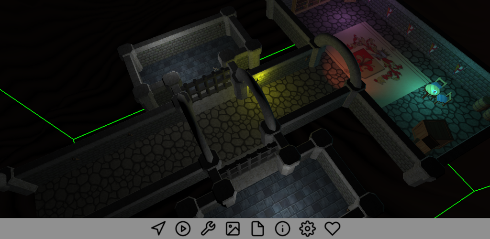

# Castle Model Viewer

Mobile-friendly viewer for 3D and 2D models like glTF, X3D, VRML, Collada, Wavefront OBJ, Spine JSON and [many other formats supported by the Castle Game Engine](https://castle-engine.io/creating_data_model_formats.php).

In addition to the above formats, it also allows to open a ZIP file that contains a single model and associated media (like textures, sounds etc.).

You can change navigation type (walk, fly, examine, 2D), jump between viewpoints, play chosen animations, save a screenshot, display scene statistics (triangle, vertex count) and more.

## Screenshots



## Usage

The application comes with a few sample files, and naturally you can open your own 3D and 2D model files.

The models must be _self-contained_, e.g. you have to

- use GLB with all the textures packed in one file,
- or X3D with all textures expressed as `PixelTexture` or data URI,
- or just put your model with data (like textures) inside a zip.
- We have [documented how to make your models self-contained here](https://castle-engine.io/castle-model-viewer-mobile).

## Building

Compile by:

- [CGE editor](https://castle-engine.io/editor). Just use menu items _"Compile"_ or _"Compile And Run"_.

- Or use [CGE command-line build tool](https://castle-engine.io/build_tool). Run `castle-engine compile` in this directory.

    To upload to Google Play as AAB, place here correct `AndroidSigningProperties.txt` and then run:

    ```
    castle-engine package --target=android --package-format=android-app-bundle --fast
    ```

    (Remove `--fast` if you don't trust FPC to make a correct incremental build.)

- Or use [Lazarus](https://www.lazarus-ide.org/). Open in Lazarus `castle_model_viewer_mobile.lpi` file and compile / run from Lazarus. Make sure to first register [CGE Lazarus packages](https://castle-engine.io/lazarus).

## License

GNU GPL >= 2.0. See the file `LICENSE`.

## Authors

- Michalis Kamburelis
- Jan Adamec
- Many contributors to the [Castle Game Engine](https://castle-engine.io/) project.

Pretty toolbar icons from https://feathericons.com/ .

### Authors of 3D graphics used in this project

Thank you for the amazing 3D stuff we could use to showcase our project!

- cat:
    - From https://sketchfab.com/3d-models/cat-murdered-soul-suspect-836312def1b84e588866500a2bf79f0f
    - License: CC Attribution
    - Author: mark2580 ( https://sketchfab.com/mark2580 )

- steampunk underwater explorer:
    - From https://sketchfab.com/3d-models/steampunk-underwater-explorer-127471a23e0f4790914b13b9052c4912
    - License: CC Attribution
    - Author: Andrius Beconis ( https://sketchfab.com/abeconis )

- dungeon:
    - From https://sketchfab.com/3d-models/dungeon-2ee94272dbf5456792eb9909c4638d1d
    - License: CC Attribution
    - Author: Federico Terzi ( https://sketchfab.com/Federico.Terzi )

- bunny:
    - From Quaternius
    - https://quaternius.com/packs/ultimatemonsters.html
    - License: public domain
    - Support the artist: https://www.patreon.com/quaternius

- The rest of graphics (mostly hand-crafted X3D files) was done by _Michalis Kamburelis_.
